<p align="center">
  
</p>

<h1 align="center">Joi 二衣装テーマ</h1>

<p align="center">
  <strong>DeepSeek Harness を、彼女の部屋に。</strong><br>
  VirtuaReal 所属 VTuber・Joi をモチーフにした非公式・非商用の DeepSeek Harness テーマプラグイン。
</p>

<p align="center">
  <a href="./README.en.md">English</a> ·
  <a href="./README.md">简体中文</a> ·
  <strong>日本語</strong> ·
  <a href="./README.ko.md">한국어</a> ·
  <a href="./README.fr.md">Français</a>
</p>

<p align="center">
  
  
  <a href="https://space.bilibili.com/61639371"></a>
</p>

<p align="center">
  
  
  <a href="./LICENSE"></a>
  <a href="./LICENSE-ASSETS.md"></a>
</p>

<p align="center">
  <a href="#overview">概要</a> ·
  <a href="#gallery">プレビュー</a> ·
  <a href="#states">ステートの演技</a> ·
  <a href="#installation">インストール</a> ·
  <a href="#wardrobe">衣装替えとネイティブ</a> ·
  <a href="#design">デザインと技術</a> ·
  <a href="#license">ライセンス</a>
</p>

---

<a id="overview"></a>

## 概要

Joi は中国の動画プラットフォーム・ビリビリで活動する VTuber で、バーチャルアーティスト
グループ VirtuaReal に所属しています。

ドット絵とサイバーパンク、映画『ブレードランナー』が好き。運動は苦手。特技は
「みかんを皮ごと一口で食べる」ことで、みかんこそ最も完璧な果物だと信じている——
🍊 が彼女の事実上の絵文字（非公式）になった由来です。

このテーマは、彼女の**公式衣装二着を、二つの完成された部屋**に仕立てました。
暖色でステージのような **Joi·Flowers** と、寒色で書斎のような **Joi·Library**。
色相を回しただけの一枚皮ではありません——下地、パネル、吹き出し、シンタックス
ハイライト、テクスチャ、キャラクターの演技まで、二式は独立した体系で、
**決して混ざりません**。そして「衣装替え」という言葉こそ、映画の Joi の物語が
このインターフェースに降り立つ唯一の場所です。

| 衣装 | 明暗 | 意味色スロット | キャラクター | 内蔵アセット |
| :---: | :---: | :---: | :---: | :---: |
| `2 式` | `ライト · ダーク · システム` | `7 + 葉` | `Joi · 軸芯 · クジラ娘` | `10 点 · 2.4 MB · 外部リンクゼロ` |

> [!IMPORTANT]
> **非公式のファン作品です。** 本プロジェクトは Joi、VirtuaReal、ビリビリ、DeepSeek
> および関連権利者との間に、所属・許諾・提携・後援・保証のいかなる関係もありません。
> キャラクターの名称・デザイン・設定および関連ブランドの権利は各権利者に帰属します。

<a id="gallery"></a>

## プレビュー

新規セッションページ。彼女は部屋の入口に立ち、視線は見出しへ。クジラ娘はタイトルの
上でうたた寝し、爪先がちょうど 4 ピクセルだけ文字に食い込みます——「上に乗っている」
と読める唯一の奥行きの手がかりです。

| | Joi·Flowers | Joi·Library |
| ---: | :---: | :---: |
| **ライト** | 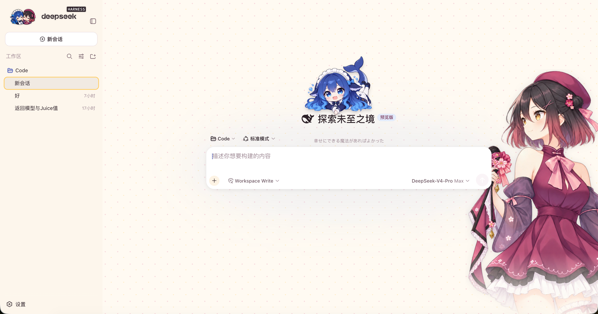 | 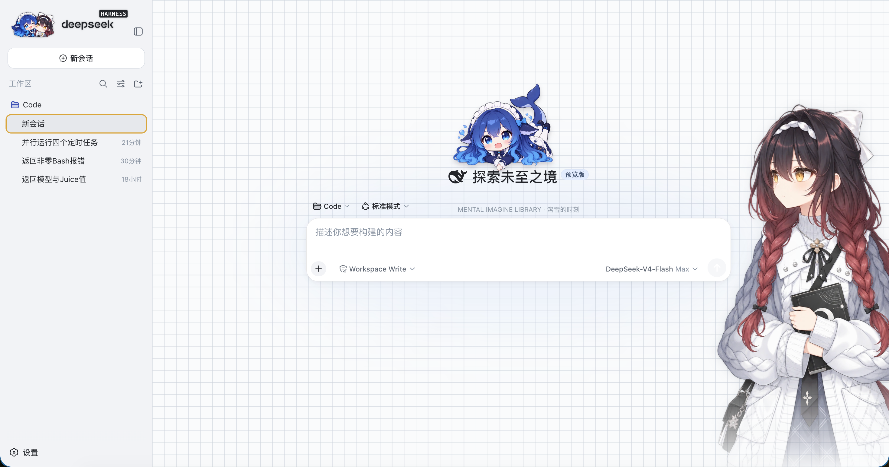 |
| **ダーク** | 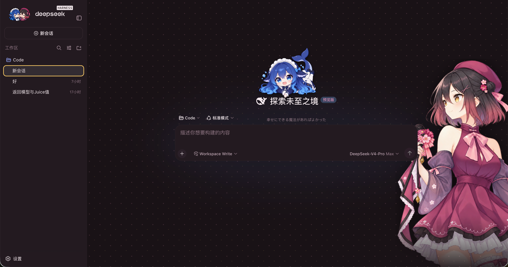 | 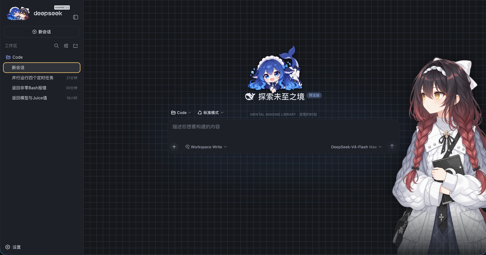 |

明暗は常にアプリ自身の外観設定に従います。衣装が変えるのは色相であって、
明るさではありません。四つの象限（二衣装 × 明暗）はすべて、同一の凍結
ベースラインに対して値単位で検証済みです。

### ふたりの記念写真

サイドバー左上のクジラアイコンは、**ふたりの記念写真**に置き換わります——
クジラ娘と Joi がひとつのダイカットステッカーに肩を寄せ合う構図。エンジンと
彼女、どちらも欠けてはいけません。写真は衣装と一緒に着替え、白い縁取りは
画像に焼き込み済みなのでライトな下地でも映えます。二枚は同一キャンバスで
整列してあり、衣装替えで顔の位置がずれることはありません。

<p align="center">
  
  &nbsp;&nbsp;
  
</p>

<a id="states"></a>

## ステートの演技

会話ページでは、入力欄の上に二人の小さな相棒が座っています。左が**軸芯**
（ファンメイドのマスコット）、右がちび **Joi**。二人はそのターンの進行に合わせて
表情を変えます——同じ語彙、同じ瞬間に確定し、決してバラバラにはなりません：

| | Joi·Flowers | Joi·Library |
| ---: | :---: | :---: |
| **待機** `info` | 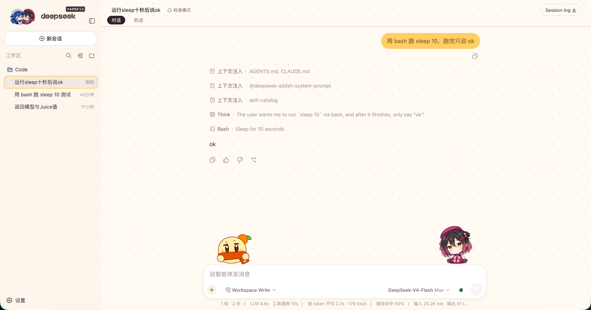 |  |
| **実行中** `running` | 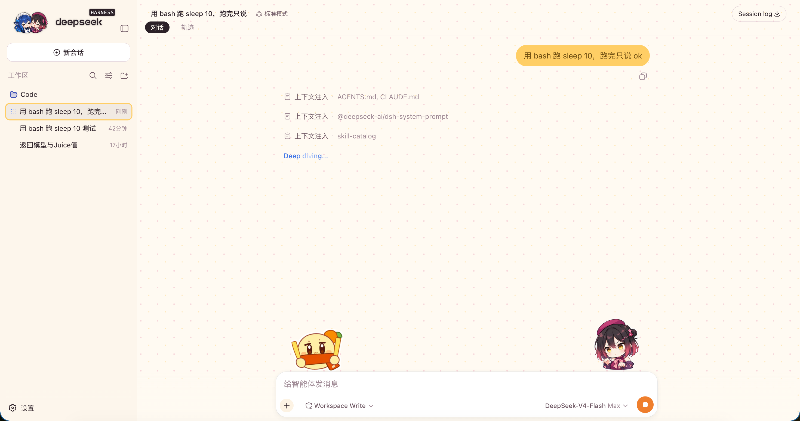 | 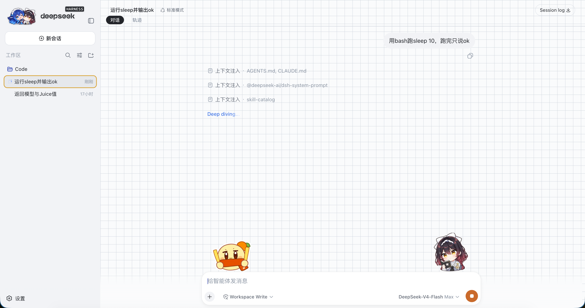 |
| **成功** `success` | 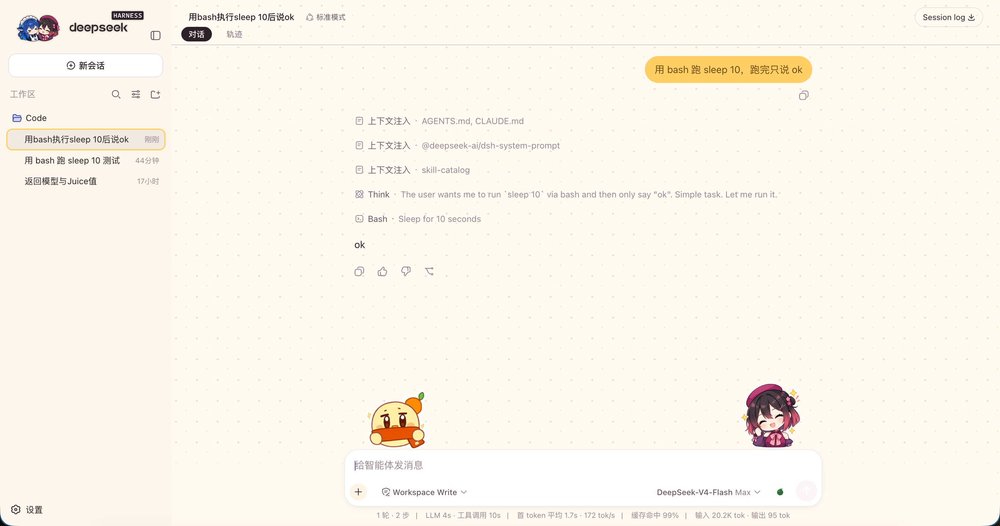 | 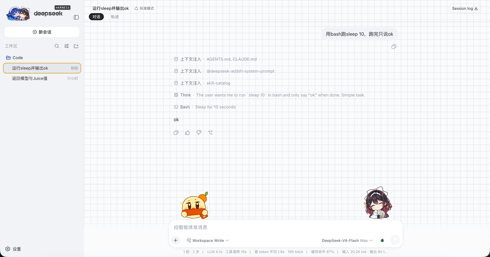 |
| **失敗** `error` | 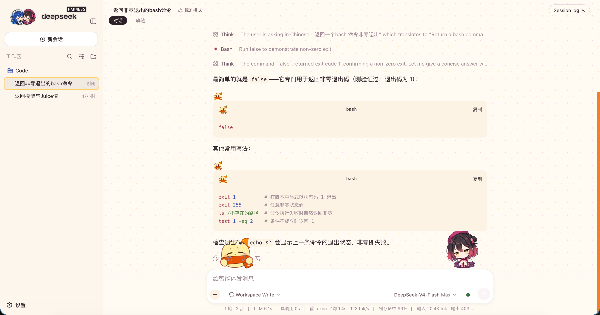 | 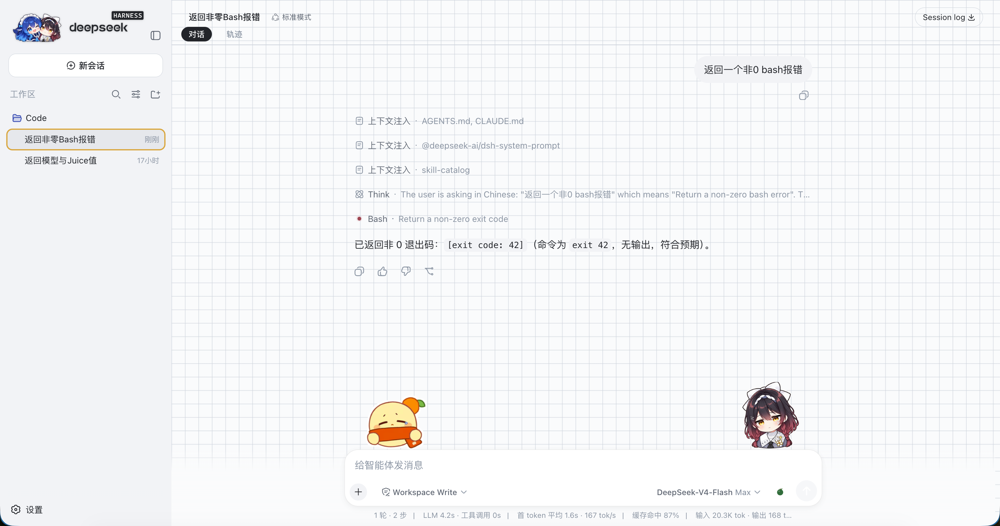 |

うまくいけば二人揃って目を細めて喜び、失敗すれば揃って目を伏せ、涙を一粒——
五秒だけ悲しんで、また持ち場に戻ります。失敗を号泣で演じることはありません。
それは彼女たちの性格ではないからです。

長い会話で文字がキャラクターに重なると、重なった行にだけ自動で下地色の縁取りが
つきます——可読性はいつでも可愛さに優先します。

<a id="installation"></a>

## インストール

DeepSeek Harness（web、`0.1.0-rc.5+`）が必要です。コマンドは一行：

```bash
dsh plugin --profile web add dsh-joi-channel-theme
```

`dsh web` を再起動してブラウザをリロードすれば、彼女がそこにいます。
アンインストールも一行：

```bash
dsh plugin --profile web remove dsh-joi-channel-theme
```

> [!NOTE]
> **ターミナルを触るのはこの一度きりです。** 以降の操作はすべて画面の中に：
> 衣装替えは 設定 → 一般、マスタースイッチは 設定 → プラグイン → プラグイン設定。
> DeepSeek Harness には現在プラグインのグラフィカルなインストーラーが無いため、
> この一手だけは避けられません。

> [!TIP]
> プラグイン構成の変更は再起動時に反映されます。削除後の UI はトークン、
> ファビコン、ワードマーク、シンタックス色まで項目単位で元に戻ります——
> 残留ゼロ、実機で逐一確認済みです。

<details>
<summary><strong>その他のインストール方法</strong></summary>

ローカルのチェックアウトから（開発用）：

```bash
dsh plugin --profile web add /path/to/dsh-joi-channel-theme
```

GitHub からの直接インストールは**推奨しません**：pnpm ≥10 が `prepare` ビルド
スクリプトを止めるため初回は必ず失敗し、表示されたパッケージキーを profile の
`pnpm-workspace.yaml` の `allowBuilds` に書き足して再実行する必要があります。
npm パッケージはビルド済みなので、ビルド許可は一切不要です。

</details>

<a id="wardrobe"></a>

## 衣装替えとネイティブ

**衣装替え**は 設定 → 一般 → 換装 にあります。衣装カードを選べば部屋ごと替わります。
下段はネイティブのライト / ダーク / システムの三択のまま——明暗は常にアプリの領分です。

**マスタースイッチ**は 設定 → プラグイン → プラグイン設定 に。オフにすれば
プラグインを入れたまま DeepSeek 純正の見た目に戻り、再びオンにすれば
直前の衣装が帰ってきます。インストールがテーマの強制になることはありません。

<details>
<summary><strong>この部屋に隠れているもの（デザインの小ネタ）</strong></summary>

- **熟れていくみかん** — コンテキスト使用量はプログレスリングではなく、
  深緑から橙紅へ熟れていく一粒のみかん。熟れすぎ自体が警告。葉は常に緑、
  ヘタは常に茶——アイデンティティは状態で変わらないから。
- **クジラ青は不変** — モデル・使用量・サブエージェントの色は二衣装で完全に同一。
  人は服を替えても、道具は替えない。
- **金色の割当** — 彼女の瞳の色 `#FFCE65` は Flowers ではユーザー吹き出しを
  満たせますが、Library ではブローチの寸法でしか現れません。抑制もまたデザイン。
- **テクスチャは衣料** — Flowers の花びらドットはドレスの柄から、Library の
  方眼紙は製図線から。
- **ワードマークの手術** — サイドバーの deepseek ロゴを丁寧に二行組みへ。
  HARNESS バッジは「ek」の e にぴたりと揃えます——ネイティブ SVG は
  1 バイトも変えず、いつでも元に戻せます。
- **🍊 はどこにでも** — ファビコンも第一階層のリストマーカーも、あの最も完璧な果物。
- **サブエージェントの小クジラ** — 並行するサブタスクは小さなクジラの列に。
  待機中は目を閉じ、実行中は潮を吹き、完了すると目を細めます。

</details>

<a id="design"></a>

## デザインと技術

このテーマには、コードより先に**凍結されたデザインベースライン**がありました。
すべての色値・アンカー・スプライト格子比率は一つの `baseline-4q.json` にあり、
コードはビルド時にそこから定数を生成します——手写しは禁止。回帰スクリプトは同じ
ベースラインで四象限を検証します（283 項目全緑が合格条件）。

| 項目 | 値 |
| --- | --- |
| プラグイン ID | `dsh-joi-channel-theme` |
| 形態 | dsh bundle + web クライアントプラグイン（公式インストール経路、クライアント改造なし） |
| トークンオーバーレイ | 衣装ごとに 19 段の中間色ランプ + 44 の意味エイリアス + 9 のシンタックストークン、明暗二値 |
| キャラクターアセット | Joi 2×2 ×2 式 · 軸芯 2×2 · クジラ娘（伏せ/立ち） · 小クジラ 1×3 |
| 内蔵アセット | WebP data URI 10 点、計 2.4 MB、外部リクエストゼロ（CSP フレンドリー） |
| 互換性 | DeepSeek Harness web `0.1.0-rc.5+` |
| さらに読む | [開発ドキュメント](./docs/DEVELOPMENT.md) |

<details>
<summary><strong>リポジトリ構成</strong></summary>

```text
dsh-joi-channel-theme/
├── README.md                 # 中国語（メイン）。en/ja/ko/fr は同階層
├── LICENSE                   # コード：MIT
├── LICENSE-ASSETS.md         # アセット：CC BY-NC-SA 4.0
├── THIRD_PARTY_NOTICES.md
├── cordis.patch.yml          # dsh bundle レイヤー
├── src/                      # ホスト側 + ブラウザ側
├── scripts/                  # ベースライン/アセット生成 · スプライト整列 · 四象限回帰
├── stuff/                    # 元アセット（未採用テイクを含む）
└── docs/                     # スクリーンショットと開発ドキュメント
```

</details>

<a id="license"></a>

## ライセンスと権利表示

本リポジトリは分類ライセンスを採用しています：

- コード、プロジェクト独自の設定、ドキュメント本文は [MIT License](./LICENSE)；
- `stuff/` と `docs/` のうち、作者が適法に許諾できる独自のビジュアル貢献は
  [CC BY-NC-SA 4.0](./LICENSE-ASSETS.md)（表示・非営利・継承）。

> [!WARNING]
> 両ライセンスは、メンテナーまたはコントリビューターが適法に許諾できる
> 独自部分のみを対象とします。Joi の名称・キャラクターデザイン・設定、
> ならびに VirtuaReal、ビリビリ、DeepSeek その他第三者の名称・商標・素材・
> 参考資料に関するいかなる権利も付与しません。

権利範囲の全容は [`THIRD_PARTY_NOTICES.md`](./THIRD_PARTY_NOTICES.md) を参照してください。

---

<p align="center">
  <sub>Unofficial fan project · Code MIT · Original assets CC BY-NC-SA 4.0 · 🍊</sub>
</p>
